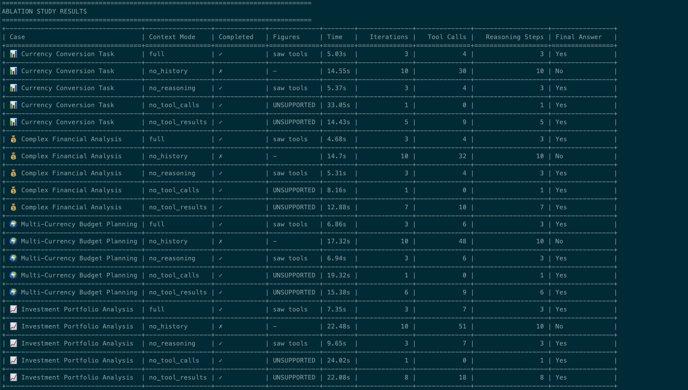
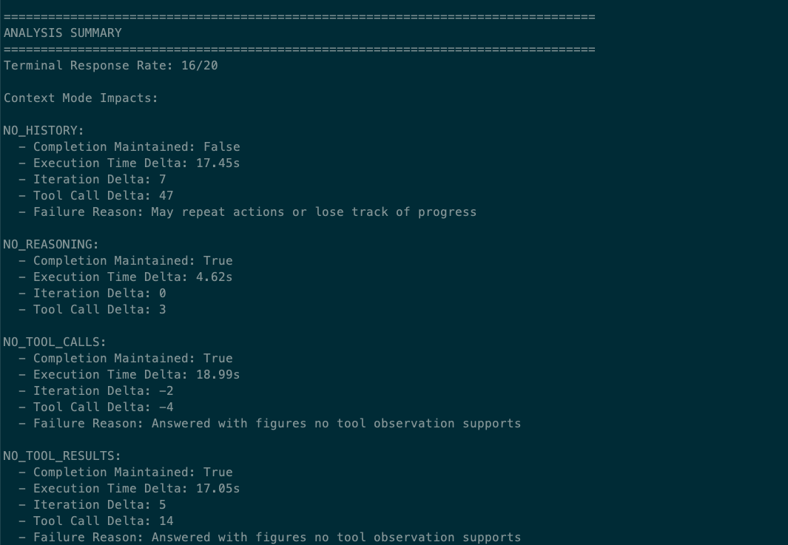
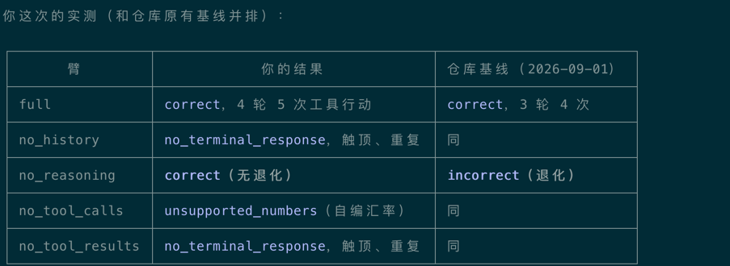

# 1-1 消融实验

## 实验目标

验证不同的上下文对agent行为的影响
- 缺少思考过程 模型思考记录的是为什么做，工具执行结果是记录发生了什么，前者可以从后者推断过来，所以丢掉它几乎没有任何代价，也就意味着模型能够完成工作
- 缺少工具定义 模型不能使用工具，也就无法获得真实反馈，最后有些模型可能编造结果，有些模型坦白拒绝
- 缺少工具结果 没有结果，模型以为工具未调用工具，可能导致无限的执行工具，最后触发最大轮次
- 缺少历史记录 和工具结果类似，只不过缺失的更多，没有用户消息、模型回复、工具执行结果，模型不断地冗余操作，最后触发最大轮次

## 运行环境

- 模型 / provider： deepseek-v4.1-flash
- Python 版本：3.13

## 我的结果

## 与书中结论对照

结果一致.

缺少思考过程，模型也能很好的完成任务，所以思考过程在上下文中不是必要的存在，可能基于模型现在能力比较强大了。
但是缺少工具定义，模型返回了编造的结果，这就是模型的幻觉，这应该在后面的过程中进行加强，通过系统提示词或者其他手段来解决
然后缺少历史和缺少工具结果，模型都会多次调用工具去获取结果，但是都无法完成任务，没有工具结果，模型也是编造了任务结果，但是没有历史的话模型甚至无法完成任务

这也符合大多数现代agent的做法，思考过程仅仅是展示给用户，不会真正的存储到历史上下文，但是工具调用、工具结果、模型回复、历史消息这些都是要保存到历史上下文中的，要不模型无法很好的完成任务
