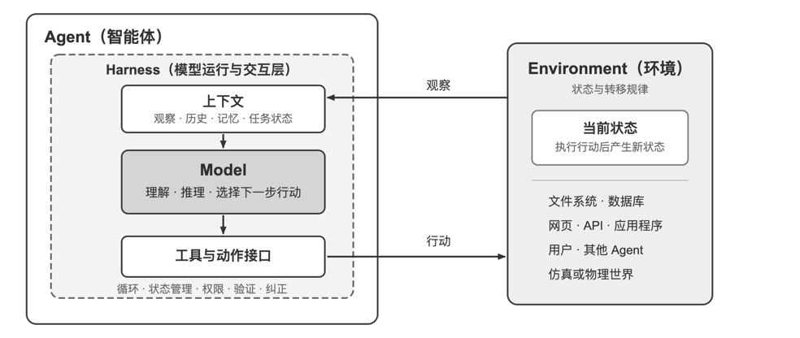
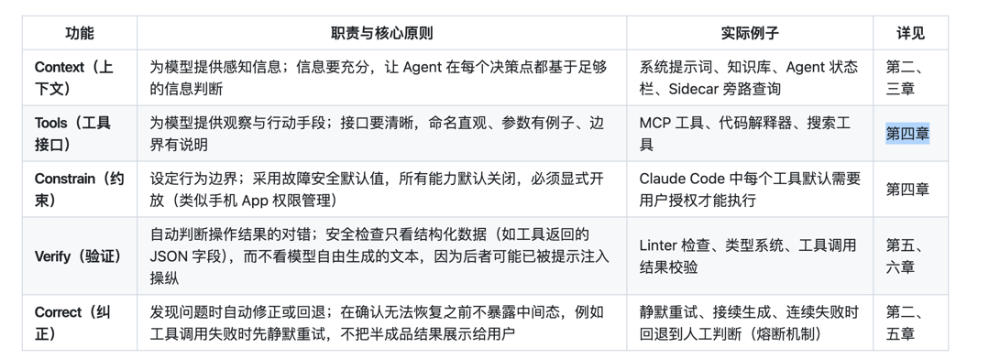

# AI Agent 入门

## 这一章解决什么问题

Agent的入门，讲解一些基本的概念为后面的课程打下基础

## 一句话总结

现代agent=LLM+上下文+工具, llm是大脑负责推理、决策，上下文是眼睛，工具是手脚负责和外界系统交互. 
然后模型之外，agent之内还包括harness，harness=上下文+工具+约束+验证+纠正

## 核心概念与定义

#### 1 现代agent=LLM+上下文+工具

- LLm是大脑，不只是模型参数，而是Agent的整个决策内核--他能理解意图、思考规划、作出判断
- 上下文是Agent的眼睛 他不只是用户输入给模型的那段文本和系统提示词， 
还有Agent在每个决策点的决策和收到的环境的观察，同时还有用户的记忆、任务的进展、自身的状态
- 工具是手脚 他是Agent用来感知和改变外部世界的接口

内层是Model和Harness的结构，Harness是Agent边界内环绕模型的运行与治理层，
负责构造上下文、暴露工具接口、维护循环和状态，并且实施权限、验证与纠正。
Harness还可以创建、隔离或代理一个环境，却不因此包含环境自身的状态与转移规律

##### 1.1 工具的分类

- 感知工具 让Agent能访问信息：搜索引擎、文件读取、api、数据库等
- 执行工具 让Agent改变世界：代码执行、文件操作、外部api调用
- 协作工具 让Agent与其他Agent分工合作： 委托子Agent完成专项任务，在关键决策点请求人类确认
- 事件触发工具 它不是Agent主动调用的，而是作为外部输入来驱动Agent开始执行任务：收到邮件、
另一个系统的webhook，这些会激活Agent，让他开始思考和行动
- 用户沟通工具 Agent主动与用户建立连接、传递信息的渠道。主要是传递信息

##### 1.2 上下文

上下文主要由5个部分构成，系统提示词和工具定义一起构成对话中保持不变的静态前缀。后面三项是随着交互不断增长的动态消息历史.

- 系统提示词: 相当于Agent的岗位说明，定义它的身份、权限和行为准则。还包含用户的跨会话记忆和动态注入的环境状态
- 工具定义: 声明工具的名称、功能描述、参数定义。 
- 用户消息： 不只是用户的输入，还要包括通过RAG动态检索引入的外部知识
- 模型回复 模型生成的回复，包括思考过程、文本内容、工具调用，但是一般思考过程不需要保存到上下文中。
- 工具执行结果 Agent框架执行工具返回的结果，这些结果是Agent下一步思考的直接依据。

#### 2 React

Agent=LLm+上下文+工具。那么他们如何协同工作呢。答案就是ReactReasoning + Acting），虽然这里只写了思考和行动，但是其实还有观察.
Agent中每次的循环都是模型先思考现在应该做什么，然后调用工具行动，然后观察行动的结果，然后再去思考下一步的心动直到任务完成

#### 3. Harness

当你编写完了这些工作之后，其实已经可以运行了，但是这里距离可靠产品还有一个巨大的鸿沟，模型可能产生幻觉，选错工具、或者遇到错误时无法自我修复。
这真是Harness要解决的问题，即让Agent在生产环境中可靠的运行。
Harness = 上下文管理 + 工具 + 约束 + 验证 + 纠正,Harness 不是模型之外的一切，而是 Agent 边界内、模型之外的运行与治理层,它负责协调 Model 与 Environment 的交互，但不包括与之交互的环境本身

#### 4. 构建Agent的核心原则

好的结构不是替Agent预演全部思考，而是守住边界，并把边界内的决策空间还给模型
- 保持简单 从最简单的方案开始，只有在必要时才增加复杂度 首先考虑单次llm调用、如果通过优化提示词和上下文就能解决问题，就不引入Agent系统，需要多步处理就引入工作流，当需要动态决策和灵活的执行路径时才引入Agent。
- 保持透明 明确显示Agent的规划步骤、执行日志、决策轨迹
- 设计好的工具接口 面相Agent设计，而不是传统的API接口。

#### 5. 全书设计模式

- 提议者-审核者 产出与批判由两个不共享上下文的角色分别承担
- 渐进式披露 不把全部信息一次性放入上下文，而是给一个可检索的目录，再按需加载.
- 只增不改 状态以追加的方式演进，已经写下的内容不在回头修改
- 边界集+保留集 任何一次修改都要同时在"它应当改变的那批样本"和"它不应当影响的那批样本"上验证
- 最小 diff + 可回滚：每次修改尽量小、带来源、可单独回滚，而不是整体重写

## 批判与思考

好的结构不是替Agent预演全部思考，而是守住边界，把边界内的决策空间还给模型。这个给我的启示还是比较大的，
目前我利用模型的工作还是相当于把它当做一个低级工程师，让他按部就班的干活，应该给他更多的自由度，让他在边界内自由发挥或许是更好的选择.
